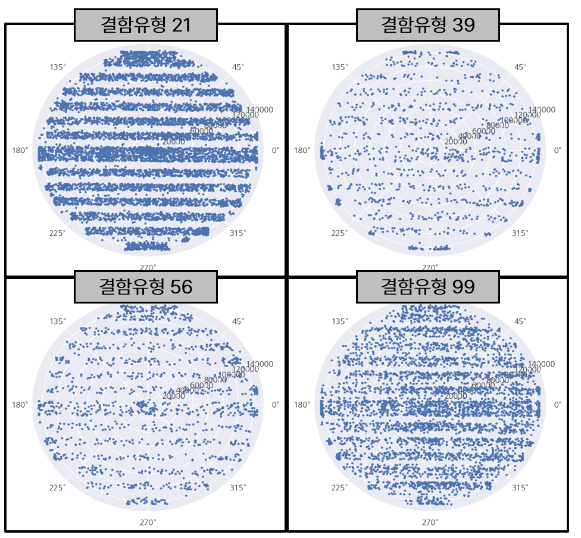
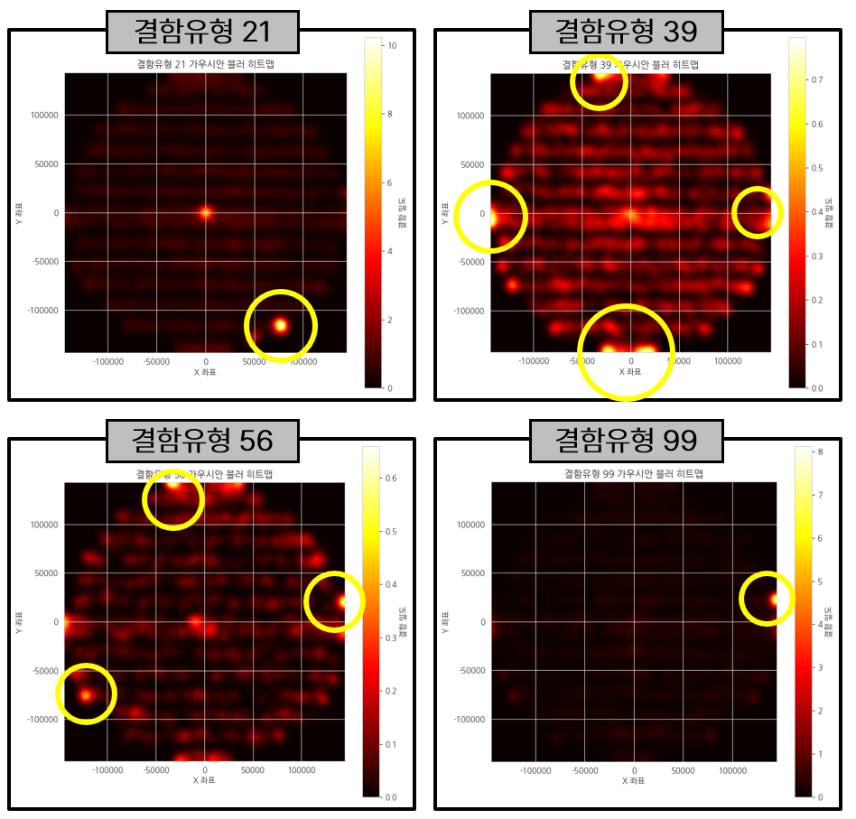

<h2># Project 01 — 불량은 우연이 아니다: 데이터 시각화로 찾는 숨은 이상탐지</h2>

> **Wafer Defect Hidden Pattern Detection via Data Visualization**

---

### Background

반도체 제조 공정에서 발생하는 결함(defect)은 단순한 무작위 노이즈가 아닌, 공정 조건의 이상을 반영하는 패턴을 내포하고 있다.  
본 프로젝트는 웨이퍼 스캐닝 데이터를 기반으로 결함의 공간적 분포, 광학적 특성, 형태적 특성을 다각도로 시각화하여  
육안으로는 포착하기 어려운 숨은 이상 패턴을 데이터 시각화를 통해 발굴하는 것을 목표로 한다.

  
  

---

### Summary

- **(1) Data Information**
  - 반도체 결함 데이터: **63,909개 샘플**, **25개 피처**
  - 공정 3종: `PC`, `RMG`, `CBCMP`
  - 주요 변수: 결함 유형(11종), 크기(가로·세로·검출면적·직경), 광학 특성(신호강도·에너지·명도), 형태 지표(정렬도·점형지수·영역잡음), 위치 정보(중심거리·방향각도)
  - 불량 여부(`REAL` / `FALSE`) 레이블 포함

- **(2) Data Preprocessing**
  - EDA: 결측치 없음, 공정별 결함률 차이 확인 (CBCMP 공정이 가장 높은 불량률)
  - 결함 유형 9번이 모든 공정에서 FALSE로 분류되는 이유 가설 검증
  - 크기 및 광학 특성을 기준으로 이상탐지 대상 정의

- **(3) Analysis & Visualization**
  - 공정별 결함 유형 분포 비교 (Count plot)
  - 결함 유형별 광학 특성 비교 (Boxplot, Violin plot, Bar chart)
  - **공간적 분포 분석**: 극좌표계(중심거리 × 방향각도) 기반 웨이퍼 위 결함 위치 시각화
  - **가우시안 블러 히트맵**: 결함 밀집 지역 식별 — 공정별 결함 패턴의 구조적 차이 발견
  - 반경 구간(center / mid / edge) × 결함 유형 분포 분석

- **(4) Key Findings**
  - 결함 유형 9번은 에너지값(에너지 강도)이 다른 유형에 비해 현저히 낮아 FALSE로 분류됨
  - 결함 유형별 공간적 분포가 상이하여, 특정 유형은 에지(edge)에, 특정 유형은 중심부에 집중됨
  - 히트맵을 통해 CBCMP 공정에서 특정 각도 방향으로의 결함 집중 패턴 확인

- **(5) Retrospective**
  - 통계적 검정 없이 시각화 중심으로 접근하여 정량적 근거가 부족한 부분이 있음
  - 도메인 지식(결함 유형의 물리적 의미)을 보완하면 인사이트의 깊이가 달라질 수 있음
  - 63,000건 이상의 대용량 데이터에서 공간 기반 시각화를 설계한 점이 프로젝트의 핵심 성과

---

### Stack

`Python` · `Pandas` · `Matplotlib` · `Seaborn` · `NumPy` · `SciPy`

---

### Files

| 파일 | 설명 |
|------|------|
| `소스코드(...).ipynb` | 전체 분석 코드 (EDA → 시각화 → 공간 분석) |
| `불량은_우연이(...).pdf` | 최종 결과 자료 |

---