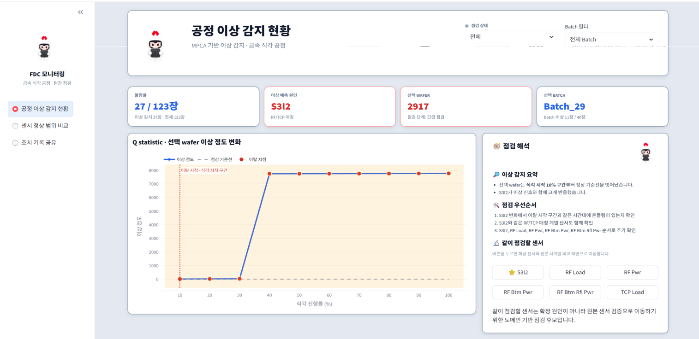

<h2># Project 03 — 금속 에칭 공정 FDC 모니터링 대시보드</h2>

> **Metal Etching Process Fault Detection & Classification (FDC) Monitoring Dashboard**

---

### Background

금속 에칭 공정에서 수집되는 대용량 다변량 센서 데이터(EV, OES, RFM)는 단일 변수 모니터링으로는 이상 원인을 특정하기 어렵다.  
본 프로젝트는 **Multivariate PCA (MPCA)** 기반 스트리밍 이상 탐지 모델을 구축하고,  
현장 엔지니어가 즉시 활용할 수 있는 **3페이지 Streamlit 대시보드**를 개발한다.  
이상 탐지 결과를 시각화할 뿐만 아니라, FDC 기반의 점검 방향과 현장 조치 매뉴얼까지 연동하여 의사결정을 지원한다.

<p align="center">
  
</p>
---

### Summary

- **(1) Data Information**
  - 3종 센서 데이터: `EV` (전기 변수), `OES` (광방출 분광), `RFM` (RF 매칭 변수)
  - 데이터 특성: Wafer 단위 다변량 시계열 (배치 공정)
  - 각 Wafer별 정상/이상 판정을 위한 Q statistic 기반 기준선 보유

- **(2) Anomaly Detection — MPCA**
  - **MPCA (Multivariate Principal Component Analysis)**: 다변량 공정 데이터를 주성분으로 압축 후 Q statistic(잔차 제곱합)으로 이상 정도 수치화
  - 스트리밍 방식 적용: Wafer 순서대로 슬라이딩 윈도우 기반 실시간 감지
  - Q threshold를 초과하는 Wafer를 이상(detected)으로 판정
  - **FDC Contribution 분석**: 이상 기여도가 높은 센서 계열(RF, TCP, Gas, Pressure, He, OES) 자동 식별

- **(3) Dashboard — 3-Page Streamlit App**

  | 페이지 | 기능 |
  |--------|------|
  | **1. 공정 이상 감지 현황** | Wafer 목록 & Q statistic 차트, KPI 카드 (점검 대상 수·이상률·원인 계열), 점검 해석 카드 |
  | **2. 센서 점검 화면** | EV/OES/RFM 원본 센서 시계열 vs 정상 Wafer 평균 ±1σ 비교, 이탈 구간·점검 방향 안내 |
  | **3. 조치 기록 공유** | 현장 엔지니어 조치 내용 입력·저장, 확인/완료 상태 관리, 초기화 기능 |

  - 관련 센서 버튼 클릭 → 페이지 2로 이동 & 해당 센서 자동 선택 (pending 패턴)
  - 현장 조치 매뉴얼: FDC 기반 점검 계열 + 현재 선택 센서 계열 동시 표시 (8종 카테고리)
  - 캐릭터 이미지, 사이드바 브랜딩 등 UI/UX 완성도

- **(4) Analysis Notebooks**
  - `피노키오프로젝트(ev_data)` / `(oes_data)` / `(rfm_data)`: 센서별 EDA 및 전처리
  - `피노키오프로젝트(스트리밍MPCA_모델)`: MPCA 모델 구현 및 Q statistic 계산
  - `피노키오프로젝트(스트리밍MPCA_드리프트_변경안)`: 공정 드리프트 처리 개선안
  - `피노키오프로젝트(데이터_융합)`: EV/OES/RFM 3종 융합 분석
  - `피노키오프로젝트(공정드리프트_해결안)`: 드리프트 보정 전략

- **(5) Retrospective**
  - FDC Contribution 분석을 통해 이상 원인을 센서 계열 수준까지 해석 가능하게 한 점이 핵심 성과
  - MPCA 모델은 정상 Wafer 기준을 고정하므로, 공정 드리프트가 발생할 경우 오탐지 증가 — 드리프트 보정 로직 추가로 개선
  - 현장 엔지니어 관점의 UX (조치 매뉴얼, 조치 기록 공유)를 대시보드에 통합한 실무 지향 설계

---

### Stack

`Python` · `Streamlit` · `Plotly` · `NumPy` · `Pandas` · `Scikit-learn (PCA)` · `CSS (Streamlit custom styling)`

---

### Files

| 파일 | 설명 |
|------|------|
| `FDC_dashboard.py` | Streamlit 대시보드 메인 앱 |
| `notebooks/` | 센서별 EDA, MPCA 모델, 드리프트 분석 노트북 |
| `결과 보고서_2팀(금속 에칭 데이터 분석).pdf` | 최종 결과 보고서 |

---

### GitHub

> 🔗 [GitHub Repository]( )  <!-- 링크 추가 예정 -->

---

### Run

```bash
streamlit run FDC_dashboard.py

> 🔗 [금속 에칭 공정 FDC 시스템 대시보드 바로가기](https://fdc-monitoring-dashboard-pprv4chs5yrhooo2dpm3oy.streamlit.app/)

```
